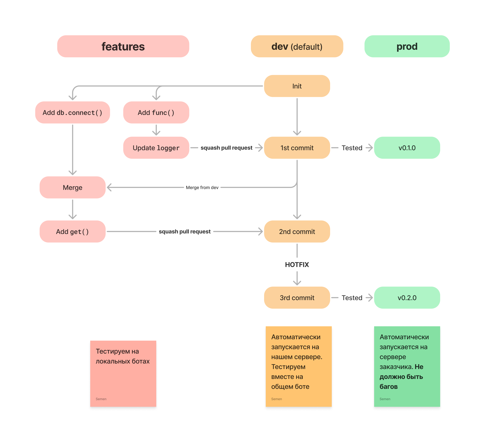

# Manager
## Description
Python bot for optimisation workers managing

## Installing
1. `git clone git@github.com:FactoryToolkit/Manager.git`
2. `poetry install`
3. `pre-commit install`
4. Run debug (`f5` in vs code)
## Launching
1. Set up firewall
2. Create user with docker and github actions roles
3. Set up github actions
4. Make ~/config/.env
5. Mkdir ~/logs

## Workflow

